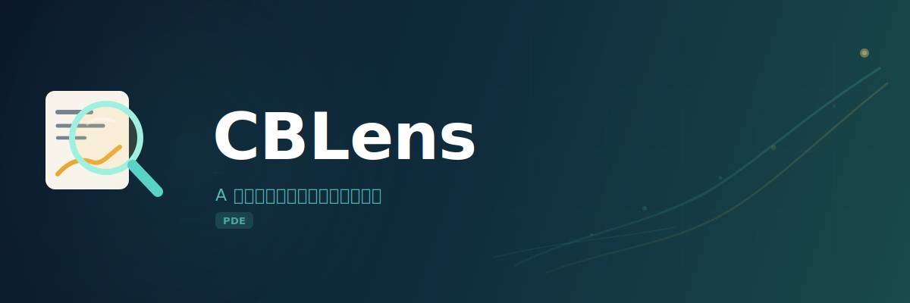
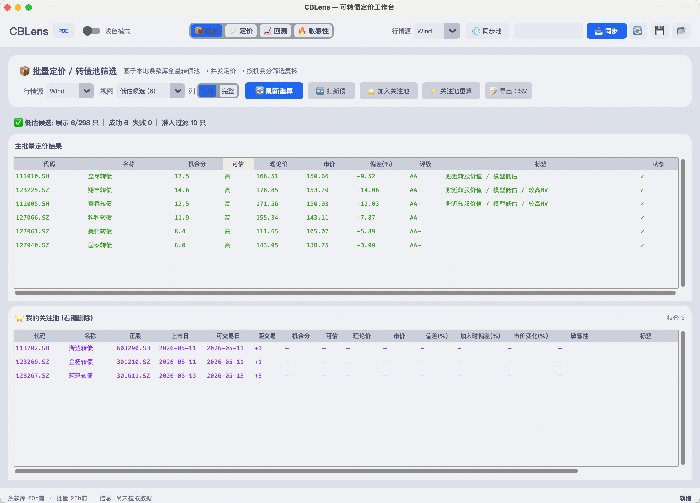
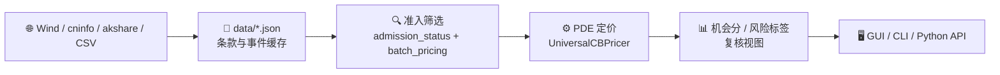

<div align="center">



<p align="center">
  <a href="https://www.python.org/downloads/"></a>
  <a href="LICENSE"></a>
  <a href="#测试"></a>
  <a href="docs/USAGE.md"></a>
  <a href="https://github.com/Grefer/ConvertibleBond/commits/master"></a>
  <a href="https://github.com/Grefer/ConvertibleBond/issues"></a>
</p>

**基于 Crank-Nicolson PDE 引擎的 A 股可转债定价与机会筛选工作台**<br/>
支持多数据源接入、公告事件解析、主池准入筛选以及完整的 GUI / CLI 研究工作流。<br/>
把转债条款、公告事件、正股行情、信用利差和数值定价模型串成一条可重复的研究管线。

</div>


---

## ✨ 项目定位

CBLens 面向 **A 股可转债研究与复盘**。它不是交易下单系统，也不是投资建议——它的目标是帮助你更快发现 *"值得人工复核"* 的低估、转股折价、事件风险和异常标的。

---

## 🧩 核心能力

<table>
<tr>
<td width="50%">

### 🔬 PDE 定价引擎
使用 **Crank-Nicolson 有限差分法**，支持：
- 强赎 / 回售 / 下修博弈
- 阶梯票息与应计利息
- 强赎宽限期与信用利差折现
- 连续股息率 `q`，股价漂移采用 `r - q`
- 希腊值 (Δ, Γ, ν, Θ) 与价值分解

</td>
<td width="50%">

### 📦 批量筛选与打分
从全市场条款库出发，自动完成：
- 主池准入筛选（停牌、强赎、ST、低流动性等）
- 批量 PDE 定价与多线程加速
- 机会分 / 置信度 / 风险标签
- 转股溢价率 / 低估率排序

</td>
</tr>
<tr>
<td>

### 📰 事件驱动分析
解析巨潮 (cninfo) 或 Wind 公告，维护结构化事件：
- 下修提议 / 通过 / 否决
- 强赎 / 不强赎公告
- 回售 / 评级变更 / 停牌 / 摘牌
- 事件自动应用回条款库

</td>
<td>

### 🖥️ 研究界面
CustomTkinter GUI 覆盖完整研究流：
- **批量页**：候选筛选 → 关注池管理
- **定价页**：单债钻取 + 隐含波动率反解
- **回测页**：历史模型偏差复盘
- **敏感性页**：σ-S 热力图 + 报告导出

</td>
</tr>
<tr>
<td>

### 🔌 多数据源架构
灵活切换数据来源：
- **Wind**：全字段条款同步 + 实时行情
- **akshare**：免费动态行情替代
- **CSV**：自定义数据导入
- 静态条款与动态行情解耦设计

</td>
<td>

### ✅ 可测试模型
核心模块均有 pytest 覆盖：
- PDE 引擎精度与收敛性
- 数据缓存 / 事件解析 / 准入筛选
- 批量定价 / API 调用链
- Wind mock 测试（无需真实连接）

</td>
</tr>
</table>

---

## 🚀 快速开始

### 安装

```bash
git clone https://github.com/Grefer/ConvertibleBond.git
cd ConvertibleBond

python -m venv .venv
source .venv/bin/activate        # Windows: .venv\Scripts\activate
python -m pip install -U pip
pip install -e ".[dev]"
```

> [!NOTE]
> **WindPy** 不通过 pip 发布。如需同步全市场条款或使用 Wind 行情，需在 Wind 终端的插件管理中把 Python 接口安装到当前虚拟环境。仅使用离线 PDE 模型、已有 `data/cb_data.json` 或 akshare 动态行情时，无需连接 Wind。

### 直接使用桌面 APP

在 [Releases](https://github.com/Grefer/ConvertibleBond/releases) 下载：

- `CBLens-macOS.zip`：解压后双击 `CBLens.app`
- `CBLens-Windows.zip`：解压后双击 `CBLens.exe`

> [!IMPORTANT]
> 桌面包暂未使用 Apple Developer ID 或 Windows Authenticode 证书签名，下载后系统会拦截：
>
> - **macOS**：双击会提示"无法验证开发者"或"已损坏"。先 `xattr -dr com.apple.quarantine /Applications/CBLens.app`（路径替换为你的实际位置），或在 Finder 里右键 → 打开 → 再次"打开"。
> - **Windows**：SmartScreen 会弹出"已保护你的电脑"。点"更多信息" → "仍要运行"。
>
> 如不放心可参考下方"源码构建桌面包"自行编译。

源码构建桌面包：

```bash
python -m pip install -e ".[desktop]"
python scripts/build_desktop.py
```

桌面 Release 发布已拆分：Windows 包由 GitHub Actions 的 `build-desktop.yml` 上传；macOS 包需在装有 Wind API 的本机运行 `python scripts/release_macos_desktop.py --tag v1.0.0` 上传，避免 CI 构建覆盖包内 WindPy 支持。

### 启动 GUI

```bash
cb-gui
# 或
python -m convertible_bond.gui.app
```

### 命令行定价

```bash
# 指定转债代码
python CB.py 128009.SZ

# 指定估值日和行情源
python CB.py 128009.SZ 2026-04-20 --source akshare

# 离线模型示例（无需数据源）
python CB.py
```

---

## 📅 每日研究流

一个典型的日常使用流程：

```bash
# ① 查看本地条款库状态
cb-sync-tradable --info

# ② 月初或新债/退市/下修集中变化后，全量同步基础条款
cb-sync-tradable

# ③ 每日刷新停牌、强赎、摘牌、正股 ST、成交额、余额、评级等准入字段
cb-sync-admission-status

# ④ 同步公告事件，并把事件状态应用回 cb_data
cb-sync-events --apply

# ⑤ 批量定价前查看主池准入报告
cb-screen-pool --min-rating A+ --min-balance 0.5

# ⑥ 打开 GUI 做批量复核、单债钻取和敏感性分析
cb-gui
```

---

## 🏗️ 架构



**五层职责**：

| 层级 | 职责 | 核心模块 |
| :---: | --- | --- |
| **① 基础信息** | 发行条款、转股价、票息、强赎/回售规则、评级、余额 | `data_providers`, `cache` |
| **② 事件状态** | 公告事件、停牌、强赎、ST、成交额等准入字段 | `cb_events`, `admission_status` |
| **③ 动态行情** | 正股/转债价格、历史波动率、股息率、无风险利率 | `data_providers` |
| **④ 模型定价** | 理论价、希腊值、纯债底、转股价值、期权溢价 | `pricer` |
| **⑤ 筛选打分** | 低估率、转股溢价、机会分、风险标签、置信度 | `batch_pricing` |

---

## 🐍 Python API

### 离线定价（无需数据源）

```python
from datetime import date
from convertible_bond.pricer import UniversalCBPricer

pricer = UniversalCBPricer(
    S0=55.0,
    K=52.77,
    current_date=date(2026, 4, 20),
    maturity_date=date(2026, 7, 30),
    issue_date=date(2020, 7, 30),
    conversion_start_date=date(2021, 2, 6),
    coupon_rates=(0.003, 0.004, 0.008, 0.015, 0.018, 0.02),
    redemption_price=107.0,
    call_notice_days=30,
)

result = pricer.price(
    sigma=0.28,
    r=0.022,
    q=0.015,
    base_spread=0.03,
    distress_k=0.05,
    p_down=0.0,
    return_greeks=True,
)
print(result["price"], result["delta"], result["bond_floor"])
```

### Provider 驱动定价

```python
from convertible_bond.pricing_api import price_from_auto

row = price_from_auto("128009.SZ", prefer="akshare")
print(row["bond_name"], row["theoretical_price"], row["market_price"], row["q"])
```

---

## 📁 项目结构

```text
ConvertibleBond/
├── assets/                     # CBLens 图标与品牌资产
├── docs/                       # 使用文档与品牌说明
├── convertible_bond/           # 主包
│   ├── pricer.py               # PDE 定价引擎
│   ├── pricing_api.py          # provider 驱动的单只/批量定价 helper
│   ├── data_providers.py       # Wind / akshare / CSV 数据源
│   ├── cache.py                # TermsBundle / TermsCache / CachedBondDataProvider
│   ├── batch_pricing.py        # 准入筛选、机会分、风险标签、批量结果缓存
│   ├── admission_status.py     # 停牌、强赎、摘牌、ST、成交额等状态刷新
│   ├── cb_events.py            # 公告事件模型与解析
│   ├── cb_event_sync.py        # 公告同步和事件应用
│   ├── cninfo_provider.py      # 巨潮公告 provider
│   ├── backtest.py             # 历史回测
│   ├── cli/                    # 同步、筛选等 CLI
│   └── gui/                    # CustomTkinter GUI
├── data/                       # 条款、事件、关注池、批量缓存
├── tests/                      # pytest 测试
├── CB.py                       # 兼容 CLI 入口
├── gui.py                      # 兼容 GUI 入口
└── pyproject.toml
```

---

## 📖 文档

| 文档 | 说明 |
| --- | --- |
| 📘 [使用文档](docs/USAGE.md) | 安装、数据源、GUI 四大页面、CLI 命令、Python API、常见问题排障 |
| 🎨 [品牌说明](docs/BRAND.md) | 项目名称由来、图标含义、调色板与使用建议 |
| 📦 [数据说明](data/README.md) | `cb_data.json`、`cb_events.json` 字段定义与刷新节奏 |
| 🔧 [维护约定](AGENTS.md) | 给 agent 和维护者看的项目级上下文与编码规范 |

---

## 🧪 测试

```bash
# 全量测试
pytest

# 快速失败模式
pytest -x -q

# 按模块
pytest tests/test_pricer.py -x -q
pytest tests/test_pricing_api.py -x -q
pytest tests/test_batch_pricing.py -x -q
```

---

## ⚠️ 模型边界

> [!WARNING]
> CBLens 是研究工具，不是交易系统。以下模型局限需要在使用时注意：

- **强赎路径依赖**：强赎触发是单点判断，尚未完整建模"30 个交易日中 15 日"的路径依赖。
- **利率结构**：当前为标量利率，未建完整期限结构。
- **股息率口径**：`q` 按连续股息率处理，数据源缺失时默认 0；不同数据源的股息率口径可能不同，建议对高股息正股做人工复核。
- **历史回测**：默认使用当前条款，历史下修发生过的债可能出现转股价跳点偏差。
- **排序局限**：批量排序用于研究复核，不能替代流动性、公告、成交约束和组合风险判断。

---

## 📄 许可

本项目基于 [MIT 许可证](LICENSE) 开源。

---

<div align="center">
  <sub>Built with 🔬 by quantitative bond researchers</sub>
  <br />
  <sub><b>CBLens</b> — 看清转债的每一面</sub>
</div>
